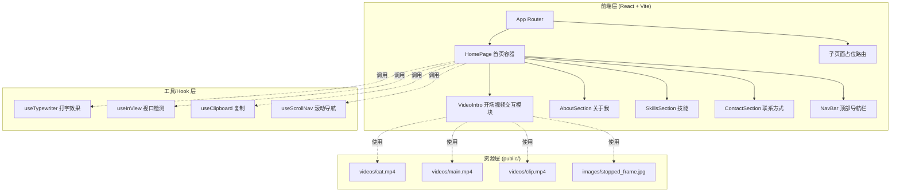
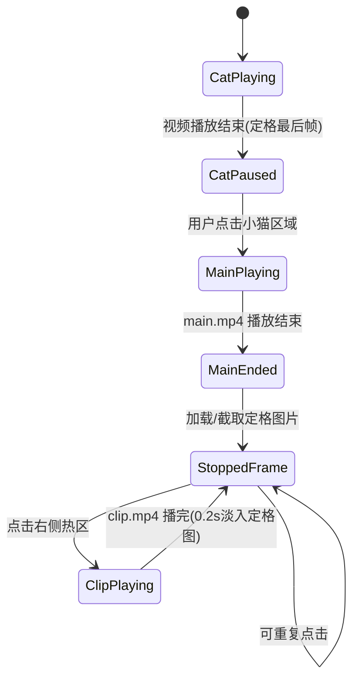

# 王鹭芳个人作品集网站 - 技术架构文档

## 1. 架构设计

## 2. 技术说明

- **前端框架**：React 18 + Vite 5（按用户要求使用 React + Vite 初始化）
- **初始化工具**：`npm create vite@latest . -- --template react`
- **路由**：react-router-dom v6（创建 /account、/project、/internship、/campus 子页面）
- **动画库**：CSS 动画为主（打字效果、呼吸闪烁、上下浮动、滑入、淡入上浮），辅以 Intersection Observer API 触发视口动画；进度条用 CSS transition 实现
- **样式方案**：原生 CSS + CSS 变量（保持轻量，避免引入 Tailwind 增加复杂度；用户未指定 Tailwind）
- **字体**：Google Fonts 引入 Noto Serif SC（衬线标题）、Quicksand（圆体正文）、Noto Sans SC（中文正文回退）
- **后端**：无（纯静态站点）
- **数据库**：无

## 3. 路由定义

| 路由 | 用途 |
|------|------|
| `/` | 首页，包含视频交互与所有内容板块（关于我/技能/联系方式） |
| `/account` | 账号运营详情子页面（占位） |
| `/project` | 项目详情子页面（占位） |
| `/internship` | 实习经历详情子页面（占位） |
| `/campus` | 校园经历详情子页面（占位） |

## 4. API 定义

无后端 API。所有数据为前端静态配置：

- 擅长标签数组：`['策划', '创意', '内容运营', '文案']`
- 工具标签数组：`['Midjourney', 'GPTs', 'Kling', 'Nanobanana', 'Codex']`
- 卡片数组：`[{emoji, title, desc, route}]` × 4
- 技能数组：`[{name, percent}]` × 5

## 5. 服务器架构

无后端，纯前端静态部署。开发服务器使用 Vite 默认端口（5173）。

## 6. 数据模型

无数据库。关键前端状态：

### 6.1 视频交互状态机

### 6.2 关键状态字段

| 状态 | 类型 | 说明 |
|------|------|------|
| `stage` | `'cat' \| 'main' \| 'stopped' \| 'clip'` | 当前视频交互阶段 |
| `catVideoEnded` | `boolean` | 小猫视频是否播放结束 |
| `mainVideoEnded` | `boolean` | 主视频是否播放结束 |
| `stoppedFrameSrc` | `string \| null` | 定格图片 src（jpg 或 canvas dataURL） |
| `clipPlaying` | `boolean` | 是否正在播放彩蛋视频 |
| `navScrolled` | `boolean` | 导航栏是否进入加深背景状态 |

